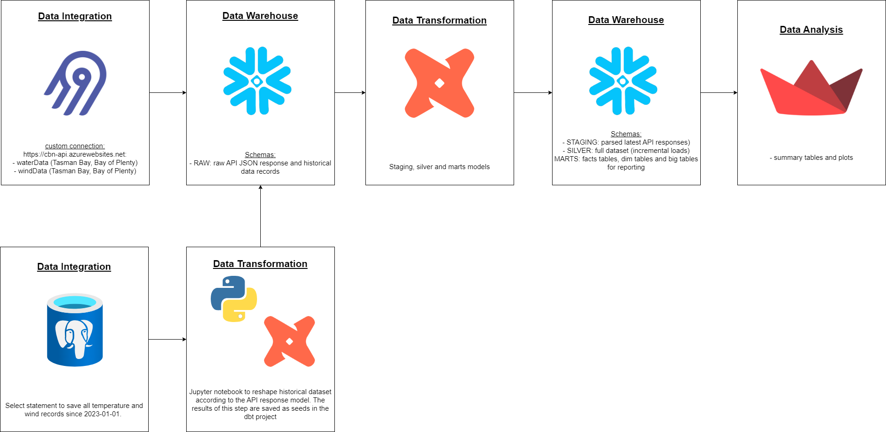

# project-2-bootcamp

## Objective of the project

The objective of this project is to is to provide an analytical instruments to visualise the oceanographic data collected by two buoys deployed in the New Zealand coast. The data (wind and temperature measurements) are collected every 15 minutes and the API of these project returns a json file with all records from three days ago until the current moment. It is common that these instruments need maintance so the ELT pipeline should handle empty API responses.

The ELT pipeline should take a table with historical records collected by these buoys from 01-01-2023 until 05-07-2023 and do incremental loads. New API requests should be schedules every 60 minutes (which should return 4 new records if the instruments are working as expected). This should return a large dataset for analyses and representation in the final data analysis step.

The final product will allow users to select the start and end time that plots should be based on and inform when was the last day that data was collected for all three sites (this should help data technicians to identify any faults in the data collection).

## Consumers of your data (What users would find your dataset useful?)

Data scientists and general public that need information about the data collected in situ.

## Datasets your team have selected

- Historical dataset: extracted from an internal DB and wrangled to meet the data structure returned from the API calls.
- CBN API endpoints (water temperature, winds and waves) for three public buoys (https://cbn-api.azurewebsites.net/docs)

Business process modeling (What business process are you going to model?)

## Solution architecture

- Airbyte (build custom connection to a private API):
  - schedule new API requests every 1h
  - save raw JSON to the DW DB in Snowflake inside the RAW schema (append as the attributes return arrays - we can not use the deduped strategy in this case as the response needs to be parsed) 
- Snowflake
  - RAW: 12 tables, one for each site (2) and endpoint (3) plus 6 to each historical dataset (connected to Airbytes)
  - RAW_STAGING: latest parsed API response
  - RAW_SILVER: the full datasets for each site + data type, which includes the historical dataset and the incremental loads
  - RAW_MARTS: 1 fact table (records) and two dimensions (wind, temperature, summary table (min, max, mean, last_update)), a periodic snapshot table (per month, including number of records) and a big table.  
- Streamlit: present results

## Breakdown of tasks:
- Create custom connections in Airbyte
- Schedule airbyte runs for every 60 min
- Create dbt project
- Save and process historical records and add the final results as csvs in the seed/ folder
- Parse latest API responses and add it to a staging schema
- Use time as incremental column to generate the complete datasets for each region + data type in the silver schema
- Use data modelling concepts to generate dim and fact tables
- Create a streamlit project to showcase the data

## Steps to build a dbt project

- create a .venv with 
- activate it:
- run `dbt init` and add all information required
- create a profiles.yml inside the folder (check data_transformation/profiles.yml file)
- go to your terminal and specify your env variables:

`export SNOWFLAKE_USER=...`
`export SNOWFLAKE_PASSWORD=...`

- create a packages.yml file (check data_transformation/packages.yml) and run `dbt deps`
- run `dbt run`