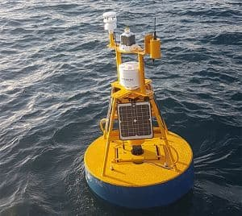
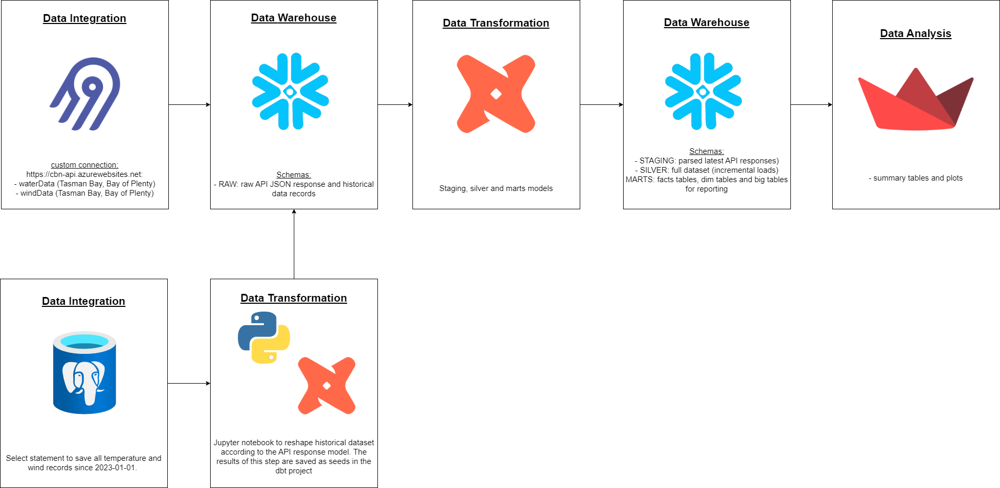

# Project 2 - Modern ELT - CBN app

Jessica - [JesSchattschneider](https://github.com/JesSchattschneider)

# Objective

- Provide an analytical instruments to visualise the oceanographic data collected by two buoys deployed in the New Zealand coast (inspired by [CBN-lite app](https://cbn-lite.cawthron.org.nz/)).
  

### Limitations of CBN:

- time range (last 3 days)
- Buoy faults (flagged based on the last record collected by each buoy)

---

# Questions/ Viz products

- When was the collected the last temperature and wind measurements?
- Dashboard with time range selection
- Wind rose for wind data
- Line plot for water temperature

---

# Data sources

| Source name | Source type | Source documentation |
| - | - | - |
| Historical data | local database/csv | water temperature and wind data |
| CBN API | REST API | [https://cbn-api.azurewebsites.net/docs](https://cbn-api.azurewebsites.net/docs) |

## Characteristics of the API

- Each endpoint retrieves a specific data type

- Only a single region can be specified in the api request

- The data (wind and temperature measurements) are collected every 15 minutes and the API of these project returns a json file with all records from three days ago until the current moment. It is common that these instruments need maintance.

---

# Solution architecture

---
# GIT

- [GIT Repository](https://github.com/JesSchattschneider/project-2-bootcamp)

---

# 1- Extract Load - Airbyte/Snowflake

- [Client API - custom builder]((http://52.65.202.108:8000/))
  - 4 streams
  - Test endpoints(http://52.65.202.108:8000/)
  
- [Destination - Snowflake](http://52.65.202.108:8000/workspaces/845858d3-9c2b-4059-91e3-8261d2791d99/connections/f910dd31-de00-4870-a73c-c7198c65a7db/status)
  - Append (limitation due to the data response where all records are of type array- it doensn't allow to use deduped)

- Schedule - Airbyte
  - Every 1 hour (3-4 new data records)

- Load - Snowflake
  - [DW / RAW](https://app.snowflake.com/msnofkg/qf00013/#/data/databases/DW/schemas/RAW)
  
---

# 2 - Transform - Jypyter notebook

- Select old records (from 2023-01 onwards) and reshape it to match the API response model (combine both datasets in snowflake - "big data").
- Save csvs as dbt/seeds

---

# 3 - Transform - DBT

- seeds (RAW)
- models
  - staging (4 models, 2 macros) - parses the last API response
    - No tests
  - silver (4 models, 1 macro) - incremental load, combines parsed data and historical dataset (Full refresh)
    - Tests: Time and region

  - marts (2 dim, 4 fact tables) - dim temp and wind use a group by averaging measurements collected at the same time and region
    - Tests: Time, region and not null and unique keys

- dbt run

---

# 4 - Streamlit (and 6)

- data_analysis (plotly)
  
- CI/CD - Github Actions + [Azure](https://portal.azure.com/#@CAWTHRON99.onmicrosoft.com/resource/subscriptions/e6bc3710-ce48-49c6-b170-f26f62906e25/resourceGroups/rg-00000-bootcampjess/providers/Microsoft.Web/sites/project2-de/slots/master/appServices)
- 
- [https://project2-de-master.azurewebsites.net/](https://project2-de-master.azurewebsites.net/)

---

# 5 - Production - AWS

- Airbyte (IP rules)
- dbt - ECS (scheduled task)

---

# Conclusions

- It it is easy to create custom API connectors in Airbyte
- Complex response models are tricky to be handled in Airbyte
- It can be tricky to deploy an airbyte service in AWS
- Macros are a great way to avoid repeting yourself
- I wish I could write models and macros using python instead of SQL

---